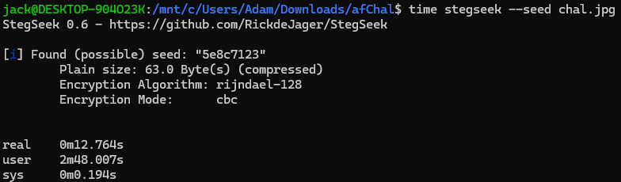
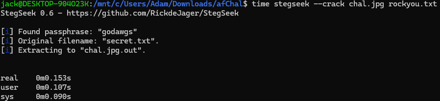
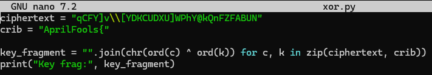

# About this Challenge
- *Challenge Author: Takumi*
- *Categories: Steganography, Cryptography, OSINT(?)*
- *Date Released: April 1st, 2026*
- *Date Completed: April 6th, 2026*
- *Provided files: chal.jpg*  
  
This CTF was created on April 1st (April Fools), of which I didn't even realized it released. I started this CTF a few days late after the hint was already released and after it was threatened to be added to DawgCTF. I could not allow this to happen!
## The Givens
Looking at the already posted information on the CTF, I am given an image of the Virginia Cavaliers logo, along with the following hint posted the day after the initial challenge.

There were a few things I noted when going into this challenge and looking at the hint. 
First off, the flag is in the form of AprilFools{*FLAG*}.
Next, there are some letters that are uppercased throughout the hint, where if we ignore the all caps KEY, we get *XORUTF8* (8 included in there because it's tall... I guess). 
Lastly, I noticed is the weird spacing between these *"sentences"*. Looking at the first letter of every word in each sentence I extracted the message *usenumbers*.
## Initial Attempts
Given only an image file, I used an image editor for some image manipulation to check for any hidden text or messages hidden in the actual photo. I also checked through the file properties/details and binwalk to check for other hidden files connected in the rather large image file. I also checked the strings of the file and attempted some XORs on it, to no useful results.
## Part 1: Steganography
Through my analysis of the image itself, I found out that steganography(steg) was used, or some form of hidden string, in the image itself. This was the vector I used to get into the next steps of the CTF.

[Stegseek](https://github.com/RickdeJager/stegseek) is a goated tool for this kind of problem. Through it I found the seed used for the steg.
  
Though that is good to know, I am still no closer to finding the hidden message in the image.
### Attempts Before the Steg Crack
Before actually finding the hidden message, I encountered many dead ends when looking for the passkey to unlock the hidden message. I tried using April 1st and its other forms, I tried using the seed from Stegseek, I even tried extracting every word from the Virginia Cavaliers Wikipedia page and checking if that ends up working, all of which did not work.
### The Crack
The way I found out the passcode for this steg was also through the use of stegseek and utilizing the RockYou wordlist. This instantly gave me a hit! *godawgs*!  
  
I'll be honest, if this wasn't the intended solution, then I don't know how you would be able to find the passphrase at all.
## Part 2: Cryptography + OSINT maybe
Now we are back into the realm of what I can do with my own prior knowledge. From the steg, I got some pretty obvious base64 text:  
`aHR0cDovL3RpbnkuY2MvZmo2MTEwMQ==`  
Taking this a turning into text we get a link to a video called *Pop Cat learns to sing* by The Roller:  
`http://tiny.cc/fj61101`

Be warned, as the channel describes, this is in fact a rick roll😨

Looking through the video itself, it's just the music video. In fact, this video is five years old. No one I know would create a video with some kind of hidden flag in it just for one CTF five years later. I need to look for something posted more recently.

Looking at the comments, most of them were written years ago, similar to the video. However, there was a more recent comment written on April 1st of this year by @takumi2315 saying "april fools!". As this is the author of this CTF, this is the most probably next thread to pull on to push forward.
## Part 3: The Video
The Takumi channel has only one video on their account titled *my favorite song (no flags here!)* posted on April 1st. The entire video is a looping gif of Garfield doing the one cat breakdance meme while *Patience* by Tame Impala plays the entire time (did you know Tame Impala is just one guy?!).

While the song is cool and all, I needed a thread to keep going and find the flag somewhere in the video. What I found was throughout the video periodically, three different strings appears at the bottom of the video.

`AprilFools{yOu_r34lly_thOught_1t_wOuld_b3_th4t_ea5y}`  
`AprilFools{7ry_again_!}`  
`qCFY]v\[YDKCUDXU]WPhY@kQnFZFABUN`  

The first two are definitely a red herring or a lie, so I did not even attempt to submit those.

The third is interesting though, I gamble that this is the final step and what I'm looking at is an encrypted version of the actual flag. Looking through what I was given, I've noticed that I haven't actually used the info from the hint given to me yet, so that was my avenue of attack for this string.

As a callback from the hint, we were given *usenumbers* and *XORUTF8*. We also know that the flag is in the form of AprilFools{*FLAG*} of which we can use as a crib to find the full string to XOR with. I whipped up the following to get a fragment of the key.

Of which it outputs: 03401034570  
``AprilFools{sfphdmdd]np[bZvkvrv`y``

After a bit of good ole' brute force shenanigans, I found the actual key is just 0340103457 and the zero that I removed was the start of it repeating the XOR cipher. We get the following output:
`AprilFools{patience_is_a_virtue}`
This is related to the song from earlier so it's probably what I was looking for.

Hooray we got the flag!
## TL;DR
1. I used the RockYou wordlist to find the passcode for the stenography on the initial image.
2. I decoded the base64 message from the steg to get a link to a YouTube video
3. I went through the YouTube comments to find the creator of the challenge's channel with a YouTube video with the flag in it
4. I decrypted the string in the YouTube with a crib to find the full number to XOR with and get the flag

## Tools Used
- [Aperi'solve](https://www.aperisolve.com)
- [Stegseek](https://github.com/RickdeJager/stegseek)
- [dCode](https://www.dcode.fr/en)
- [CyberChef](https://cyberchef.org/)
